## Телеграмм бот для изучения английского языка инструкция

#### [1. Установка программ](#install) 
#### [2. Клонирование репозитория GIT](#install)
#### [3. Настройка среды](#install)
#### [4. Конфигурация бота](#install)
#### [5. Добавления контента](#install)

## Установка программ

Прежде чем начать развертывать бота установи сдедующие программы:

1. [PyCharm](https://www.jetbrains.com/pycharm/download/?section=windows) - понадобится для запуска и простого обновления кода если в будующем я буду вносить какие то изменения
2. [GitBush](https://git-scm.com/downloads)

## 2. Клонирование репозитория GIT

После того как установишь все программки содай папку в люьом месие на компьютере куда ты поместишь проект

Зайди в эту папку кликни правой кнопкой мышки на свобную зону папки и в открывшемся контекстномном меню и выбери `Open Git Bash here`:

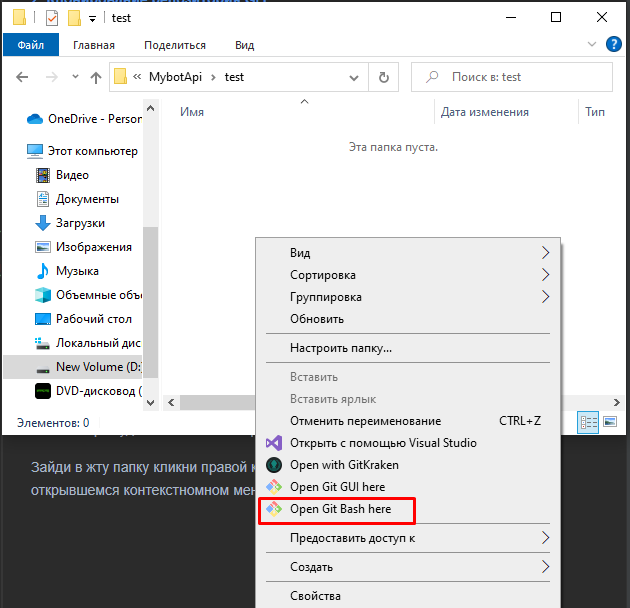

если всё сделанно верно то увидишь терминал:

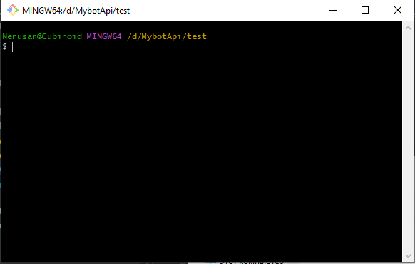

теперь в открывшемся терминале введи команду:

```shell
git clone https://github.com/NeysonAdams/english_bot.git
```

Дождись когда прокет скачается в папку.

## 3. Настройка среды

Теперь надо открыть проект в Pycharm. На стартовой странице PyCharm нажми `Open Project`:

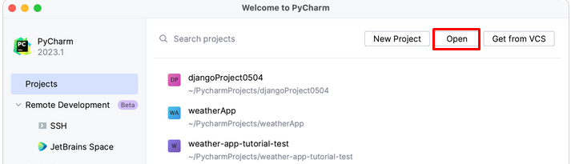

и укажи путь к папке с проектом. Если всё слеоанно правильно то откроется программа и в левой части тф увидишь структуру проекта:

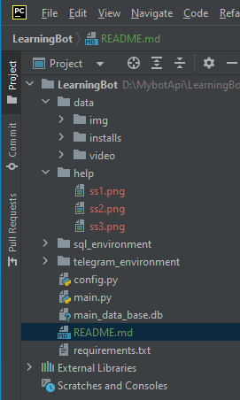

теперь для корректной работы программы тебе нужно создать среду и настройти её для этого нажи сочетание клавиш `CTRL+ALT+S` откроется окно настроек.
в открывшемся окне выбери `Project:LearningBot > Project Interpreter > Add Interpreter > Add Local Interpreter`:

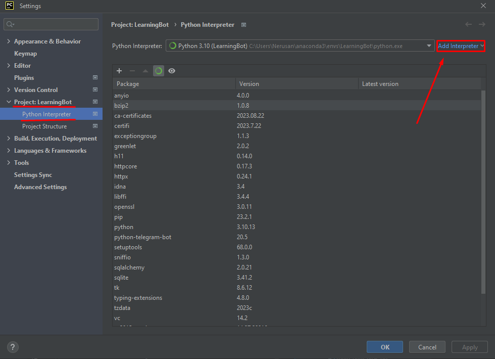

В открывшемся окне выбери `Virtualenv Environment`, отметь флажок `New` нажми `OK`. Обрати внимание на имя проекта. А после в окне `Settings` нажми `Apply` и закрой окно настроек

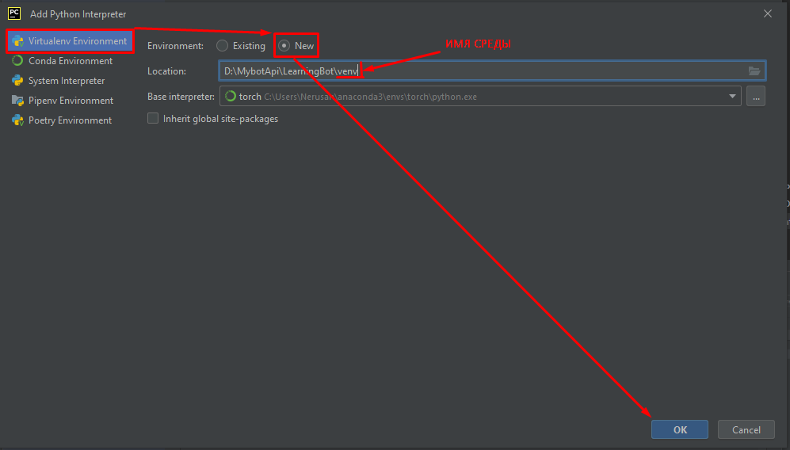

Поздравляю среда создана теперь тебе нужно её настройть. Для этого я подготовил тебе фаил с настройками `requirements.txt`. 
Для того что бы воспольщоваться этим файлом в нижней части окна Pycharm найди  вкладку `Terminal`, затем во вкладке сверху найди стрелку вниз и в открывшемся меню выбери `Command Promt`. Обрати внимание на имя в окощке терминала оно должно соответствовать имеени среды

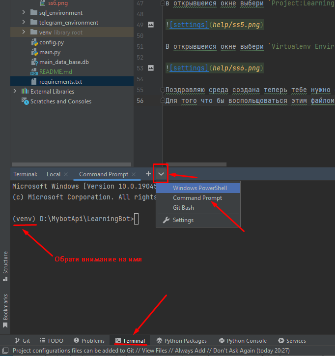

В терминале введи команду 

```shell
pip install -r requirements.txt
```

Настройка может занять какое то время. Дожди окончания

## 4. Конфигурация бота
 Открой Телеграмм в Поиске введи [@BotFather](https://t.me/BotFather)
 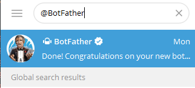
 Введи команду `/newbot` следуя инструкциям создай бота, для того что бы получить КЛЮЧ или TOKEN
 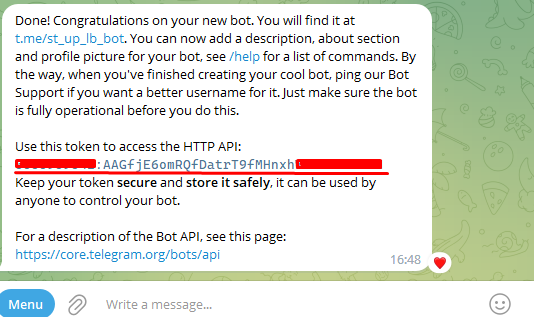

скопируй этот ключ а затем в программе Pycharm уже в открытом прокте открой фаил `config.py` и замение в ковычках переменной TOKEN на скопированный ключ

  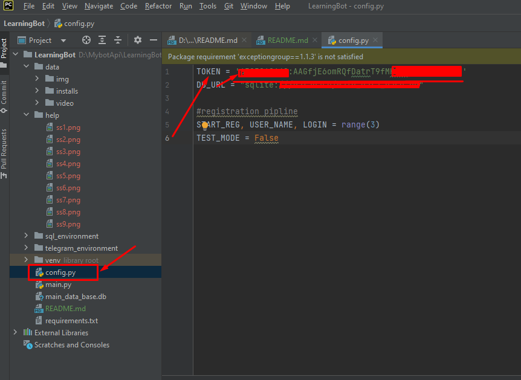

Отлично теперь всё готово готово для запуска. Для того что бы запустить выбери фаил `main.py` нажми правой кнопкой мыщи и выбери `Run`

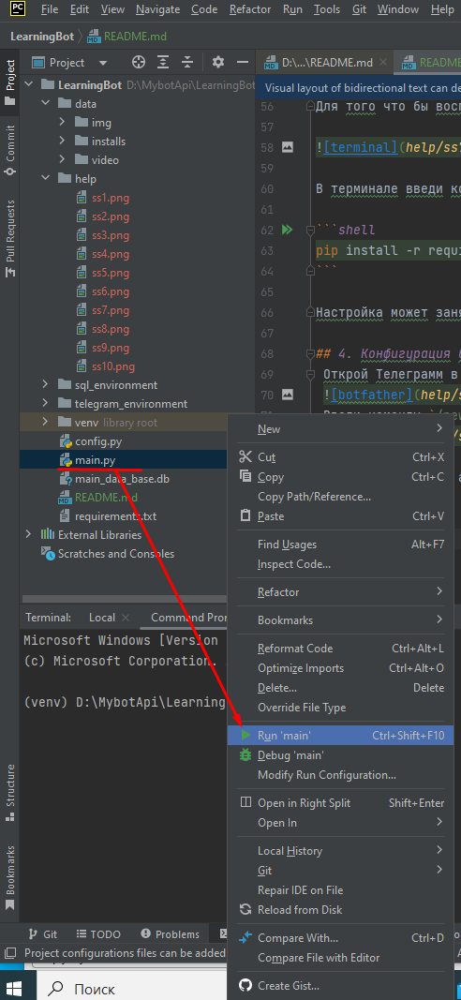

## 5. Добавления контента

В Папке проекта найди и открой  папку  `data` затем папку `install` затем запусти установку программы`DB.Browser.for.SQLite-3.12.2-win32.msi` 
Это программа для работы с базой данный в которой хранится контент 

Обрати внмание что в папне `data` есть еще 2 папки `img` для картинок и  `video` для видеоуроков

После установки открой программу DB Browser(Sqlite)в открывшемся окне выбери `Открыть базу данных`. Укажи путь под папки с проектом и выбери фаил `main_data_base.db`

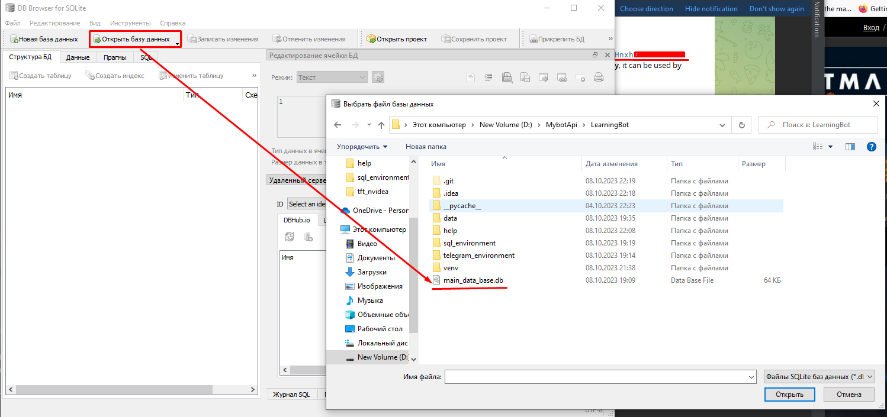

после ты увидишь какие есть таблицы а перейдя во вкладку `Данные`и смодешь просмотреть данные
